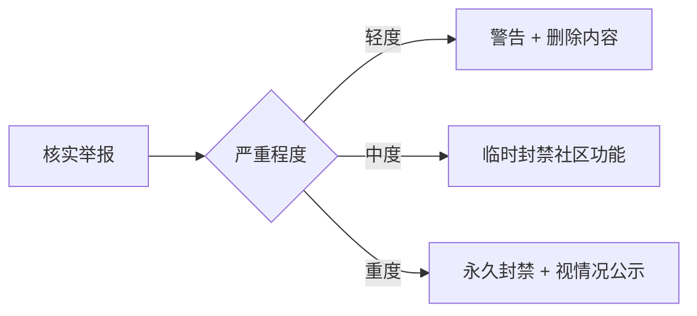

# 社区行为守则（Code of Conduct）

## 我们的承诺

为营造**开放、安全、尊重**的开源社区，我们承诺：无论年龄、体型、可见或不可见的残疾、族裔、性别认同与表达、经验水平、教育程度、社会经济地位、国籍、外貌、种族、宗教或性取向如何，所有参与者都不受骚扰。

为营造开放、安全、尊重的社区环境，所有参与者（贡献者、用户、维护者）都应：

- ✅ 尊重他人，包容不同观点与经验
- ✅ 友善接受建设性批评
- ✅ 关注对整个社区最有利的事
- ✅ 对社区其他成员展现同理心

本社区用户包含大量青少年开发者，**严禁任何利用技术优势欺压他人的行为**。

---

## 适用范围

本守则适用于所有社区空间，包括但不限于：

- GitHub 仓库的 Issues、Pull Requests、Discussions
- 站点内的文章评论、控件描述与 README 等用户产生内容
- 社区聊天群、线下活动及官方社交媒体
- 以官方身份在这些空间中的一切言行

---

## 不可接受的行为

以下行为在任何社区场景均不被容忍：

| 类别 | 具体示例 |
| --- | --- |
| 人身攻击 | 侮辱、贬低、威胁他人，公开或暗示他人能力不足 |
| 歧视言论 | 针对种族、性别、年龄、国籍、宗教、残疾等的攻击性言论 |
| 性骚扰 | 不受欢迎的性关注、露骨图片/文字、性暗示玩笑 |
| 危害未成年人 | 诱导未成年人分享隐私、发布不适宜内容、实施网络欺凌 |
| 破坏行为 | 提交恶意代码、刷屏、散布谣言、煽动对立、DDoS 等 |
| 泄露隐私 | 未经许可发布他人的真实姓名、住址、邮箱等个人信息（Doxxing） |
| 商业滥用 | 违反[用户协议](https://cc.zitzhen.cn/agreement/useragreement)利用社区代码/项目从事违规盈利活动 |

---

## 执行守则

### 举报

如遇或目击违规行为，请通过以下方式联系维护团队：

- 邮件：`xiaozhen49@outlook.com`
- 安全/隐私相关紧急事件：见 [SECURITY.md](SECURITY.md) 的报告渠道
- 提交证据：相关链接、截图与时间线

我们承诺 **24 小时内首次响应**，并对举报者身份严格保密。

### 处理流程

维护者在核实后，根据严重程度采取相应措施：

### 维护者义务

- 公正、一致地执行守则，避免利益冲突
- 对模糊或无先例的场景集体讨论后再决定
- 举报内容只在处理所需的最小范围内共享

---

## 守则基础

1. **法律合规**：遵守中国《网络安全法》《未成年人保护法》《个人信息保护法》及 GitHub 平台规则
2. **开源精神**：践行开源社区通行的伦理准则
3. **儿童优先**：对涉及未成年人的违规行为零容忍

---

## 附则

1. 本守则是[用户协议](https://cc.zitzhen.cn/agreement/useragreement)的补充，冲突时以协议为准
2. 维护团队保留对未预见场景的最终解释权，并会在执行中持续完善本守则
3. 守则更新将提前公告 7 天后生效

> 遇到冲突时，请先尝试非暴力沟通。你不是孤岛，我们共同守护这个学习型社区。

本守则参考 [Contributor Covenant 2.1](https://www.contributor-covenant.org/version/2/1/code_of_conduct/) 制定。
