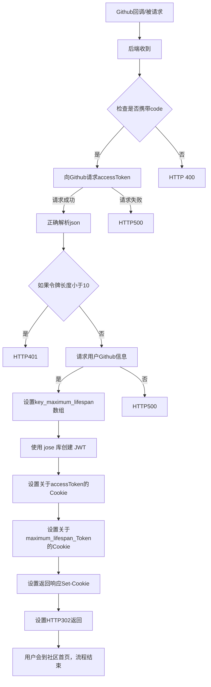
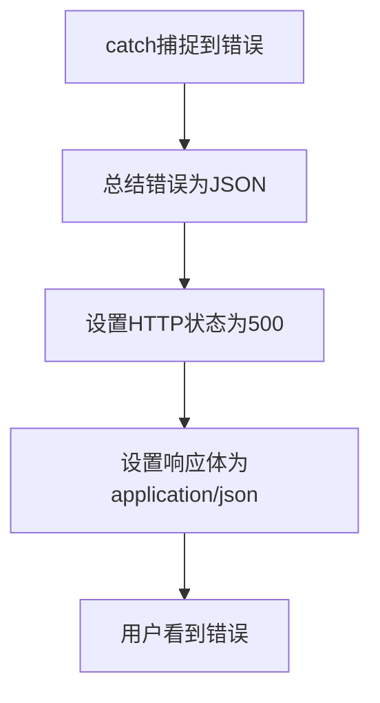
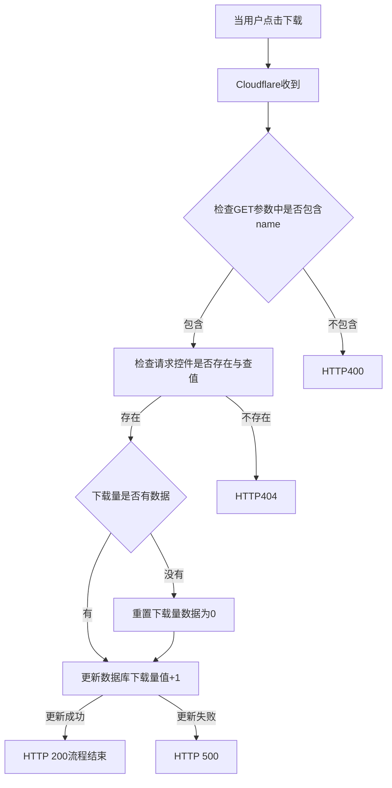

# Github OAuth后端请求
后端边缘函数源代码：[Code](https://github.com/zitzhen/CoCo-Community/blob/main/functions/auth/github.ts)
## API简介
用于Github OAuth的登录，通过Github返回的code换取`accessToken`并生成最大生命周期JWT令牌，并保存到用户的httponly cookie。
## 请求方法

| 请求方法 | 是否可用 |
| ---- | ---- |
| GET  | ✅Yes |
| POST | ❌No  |
## 全流程

## 意外错误捕捉

# 增加下载量API
后端边缘函数源代码：[Code](https://github.com/zitzhen/CoCo-Community/blob/main/functions/api/download.ts)
## API简介
当用户点击CoCo-Community中的下载按钮时，CoCo-Community会自动请求此API以记录下载量。
## 请求方法
| 请求方法 | 是否可用 |
| ---- | ---- |
| GET  | ✅Yes |
| POST | ❌No  |
## 全流程

## 意外错误捕捉

