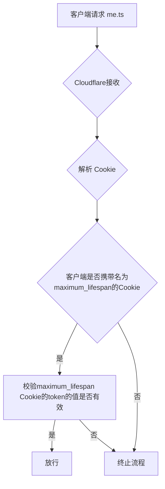
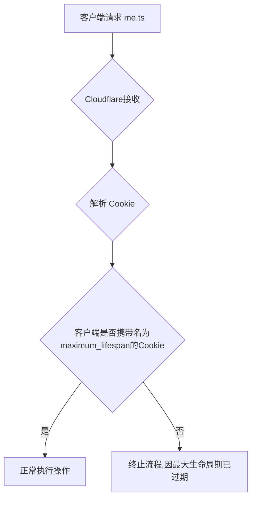

Github Issues:https://github.com/zitzhen/CoCo-Community/issues/682
## 前景讨论
### 非「滑动过期」
在之前，我们一直都采用保存用户状态7天的流程。但是这并不好，这会导致7天后用户需要重新登录。因为用户浏览器的Cookie被过期删除了，相当于给用户进行强制退出了。

我们应该优化一下，并实现「滑动过期」
### 新方案——「滑动过期」
指用户在登录状态访问网站时，今天登录了，有效期为7天。当明天访问网站时，后端检查到了他的登录，那么我们就将用户的Cookie延长到7天后再过期。以此实现「滑动过期」

### 安全与风险
- 可采用“渐进式滑动过期”，避免用户的设备出现被盗情况。攻击者通过无限延长机制一直活跃。
### 定义：“渐进式滑动过期”
指在用户登录后的延长时间的区别，如下图：
- 第一天登录=>设置默认到期时间为7天后到期。
- 二次活跃=>延长Cookie到期时间为3天
> [!NOTE]
> 这里所指的`7天`，`3天`等，这类时间并不固定，后期可适当调整。
## 数据透视
## 表格
## 用户操作与服务执行

| 用户操作  | 执行操作              |
| ----- | ----------------- |
| 第一次登录 | 设置Cookie默认到期时间为7天 |
| 二次活跃  | 设置Cookie到期时间延长3天  |
## 各项数据的极限
>[!tip]
>仅做预计

最短生命周期：未定
最长生命周期：30天

## 实现方式及代码
### 方案概括与思路
通过每次访问发送一次请求到 Edge function ,Edge function发回指令更新浏览器Cookie到期时间。
最长生命周期通过另一个Cookite有效期为30天，已登录>=30天的将强制过期Cookie强制退出登录，其中为了保障安全新增的maximum_lifespan Cookie需要有一个token，并使用JWT。防止攻击者伪造Cookie。
#### 逻辑导图（查询用户信息）


### 代码实践
我们在`src/views/inex.vue`中，有这样一段代码
```js
checkLoginStatus().then((logininformation) => {
    if (!logininformation || !logininformation.authenticated) {
      this.username = '未登录用户';
      this.avatar = '/images/user.png';
    } else {
      this.username = logininformation.user.name || logininformation.user.login;
      this.avatar = logininformation.user.avatar_url || '/images/user.png';
    }
```
我们已经向后端发送了存放在浏览器Cookie的token，进行查询。
那么我们可以更改后端的Edge function的代码，同时增加延期操作。

在登录返回toekn的Edge function中，我们原本定义了这一个Cookite进行了操作
```ts
const cookie = [
      `token=${accessToken}`,
      "Path=/",
      "HttpOnly",
      "Secure",
      "SameSite=Lax",
      `Expires=${new Date(Date.now() + 7 * 24 * 60 * 60 * 1000).toUTCString()}`,
    ].join("; ");
```
这里存储了一个名为token的Cookie。

| 属性名      | 值/是否  | 备注                          |
| -------- | ----- | --------------------------- |
| 名称       | token | -                           |
| Path     | Yes   | 此Cookie对全站有效                |
| Expires  | 7天后   | 明确7天后过期                     |
| HttpOnly | Yes   | 禁前端读取                       |
| Secure   | Yes   | 仅限HTTPS传输                   |
| SameSite | Lax   | 限制跨站请求时发送 Cookie，提供 CSRF 保护 |
#### 新的代码变动
我们可以再创建一个新Cookie，如下表：

| 属性名      | 值/是否             | 备注                          |
| -------- | ---------------- | --------------------------- |
| 名称       | maximum_lifespan | 最大生命周期，强制退出登录的时间            |
| Path     | Yes              | 全站有效                        |
| Expires  | 30天后             | 30天后强制退出                    |
| HttpOnly | Yes              | 禁前端读取                       |
| Secure   | Yes              | 仅限HTTPS传输                   |
| SameSite | Lax              | 限制跨站请求时发送 Cookie，提供 CSRF 保护 |
对应的代码：
```ts
const maximum_lifespan = [
      `maximum_lifespan=${maximum_lifespan_token}`,
      "Path=/",
      "HttpOnly",
      "Secure",
      "SameSite=Lax",
      `Expires=${new Date(Date.now() + 30 * 24 * 60 * 60 * 1000).toUTCString()}`,
    ].join("; ");
```

我们的`me.ts`查询文件也需要修改，以下图标是判断逻辑。
# 因安全问题废弃的的方案
## 通过添加一个名为maximum_lifespan的Cookie指定最大生命周期存在未认证的问题
>[!CAUTION]
>永远不要再使用此方案，因为他因安全问题废弃

## 当时流程（安全隐患）

为什么这是一个安全隐患？如下：
1.攻击者可伪造一个Cookie，使得最长生命周期用不到期。
2.缺少认证，Edge function不会知道他是伪造的。