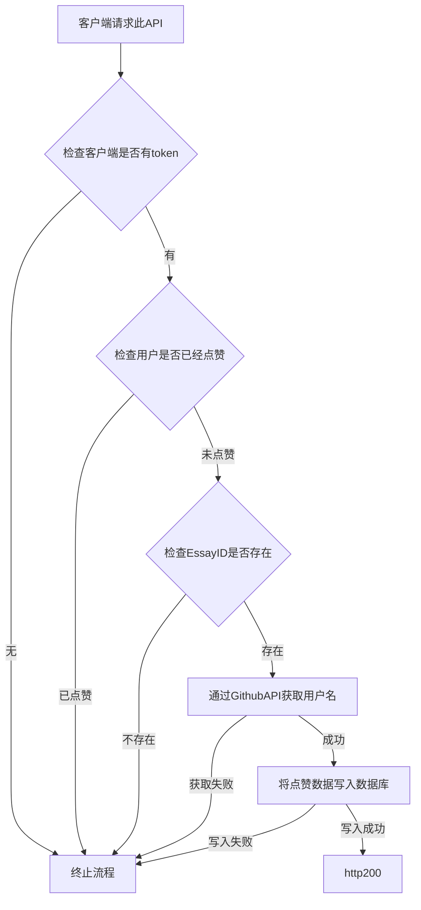

我们点赞与收藏采用独立的数据表，我们将创建两个表：
- essay_like
- essay_collect
## 数据表结构
| 字段       | 备注        |
| -------- | --------- |
| ID       | 主键ID自增    |
| username | 点赞/收藏者用户名 |
| essayid  | essayID   |
| time     | 收藏时间      |

## Essay点赞API

### API端点
`/api/essay/like`

### 请求方法
GET

### 请求参数
| 参数名    | 类型   | 必填 | 说明      |
| --------- | ------ | ---- | --------- |
| EssayID   | 整数   | 是   | 文章的ID  |

### 请求头
需要在Cookie中包含两个有效的认证token：
- `maximum_lifespan`: JWT token，用于身份验证
- `token`: GitHub token，用于GitHub API调用

### 请求示例
```
GET /api/essay/like?EssayID=123
Cookie: maximum_lifespan=your_jwt_token; token=your_github_token
```

### 响应格式
成功响应：
```json
{
  "status": "success",
  "message": "Essay liked successfully"
}
```

错误响应：
```json
{
  "status": "error",
  "message": "错误信息"
}
```

### 响应状态码
- 200: 操作成功
- 400: 请求参数错误或用户已点赞
- 401: 未认证或认证失败
- 404: 文章不存在
- 405: 请求方法不被允许
- 500: 服务器内部错误

### 业务逻辑
1. 检查请求方法是否为GET
2. 从Cookie中获取认证token
3. 验证token的有效性
4. 检查EssayID参数是否存在且为有效数字
5. 检查用户是否已经点赞了此文章
6. 检查EssayID对应的文章是否存在
7. 通过GitHub API验证用户身份
8. 将点赞数据写入数据库

## 后端及处理

